# 华中科技大学 物理实验课程通关企划

说明： 本仓库是用来给本人练手的，后续将会合并到<https://github.com/minggong6/HUST_COURSE>（华中科技大学本科生课程攻略共享计划）中，之后本仓库将变为私有，敬请注意。 请大家Star上述共享计划，即yuhang同学的仓库！这是很多本科生大家一起搭建起来的，虽然现在知名度不是很高，但我相信在不断完善下，这份仓库终有一天会得到广泛的传播，影响着更多的Husters！

「*知识理应流动。*」

## 声明

> [!CAUTION]
>
> **本企划中，本人不对本课程任课老师进行评价。由使用本企划中任意内容所引起的各类问题，本人不承担责任。**
>
> <u>**严禁将与本企划相关的任何内容用于商业用途。**</u>
>
> **所有内容参考资料均为2025年的官方讲义/PPT。请大家对照官方（选课系统上）最新版的讲义/PPT食用。**
> **文件中如有任何地方发现问题，敬请指正。可在Issue中新建话题，也可Fork仓库，更改后提交Pull Request。**
> **如有意见或建议，也欢迎在Issue中新建话题。**
>
> **欢迎大家转发推广。本企划中的任意资料请随意使用（商业用途除外）。**

## 写在前面

配套视频：https://www.bilibili.com/video/BV1EHR6YpELF 资源链接（百度网盘）：https://pan.baidu.com/s/1ZgAwKKGX6y_FmunpBjjZZg?pwd=3iw5

本仓库和网盘中的资源会同步更新。

长期以来，物理实验以时间长、意义小、任务重、老师打分分差大、实验难度区别大等问题饱受大家诟病。 我们不能直接删掉这门课，但我们希望通过自己的行动，为大家减小一点物理实验上的负担。

> [!IMPORTANT]
>
> **不要浪费时间在物理实验上！谁浪费我笑话谁！！！**

## 关于物理实验

基本情况如下：

|    课程名称    | 课程编号 | 开课学期 |               开课对象               | 学分 | 学时 | 选做实验数量 |
| :------------: | :------: | :------: | :----------------------------------: | :--: | :--: | :----------: |
| 物理实验（上） | PHY0191  | 第二学期 | 全校理工大类各专业学生（除物理学院） |  2   |  32  |      7       |
| 物理实验（下） | PHY0201  | 第三学期 | 全校理工大类各专业学生（除物理学院） | 1.5  |  24  |      6       |
| 物理实验（二） | PHY0561  | 第二学期 |        全校医科大类各专业学生        | 0.75 |  24  |      5       |

在物理实验课上...

1. 虽然说过程很痛苦，但是确实也学不到什么东西
2. 做了那么多实验，考试的时候还是看不懂不会写
3. 明白什么叫信息差，什么叫选择大于努力，什么叫不要太老实
4. 获得练字的大好机会，有的你好抄的（或者获得科技产品xieziji的使用实践）
5. 获得难忘的赤石经历，等毕业工作了相信你都不会忘

## 关于第一次课（绪论）

课表上第一次物理实验课的教室一般会安排在西十二楼或东十二楼，请大家带好纸笔，按时前往。课的内容前半段是物理实验发展历程，较为无聊也不会考；后半段会介绍上课要求、选课系统的使用方法，大家要注意记录，也可同步在手机或电脑上操作，加深印象。老师后面还会介绍不确定度的计算、有效数字取舍、作图等问题，这个后面都会用到，也建议大家留意一下。

课上说会用到下面的两本参考书，大家**不用买**因为完全用不到。

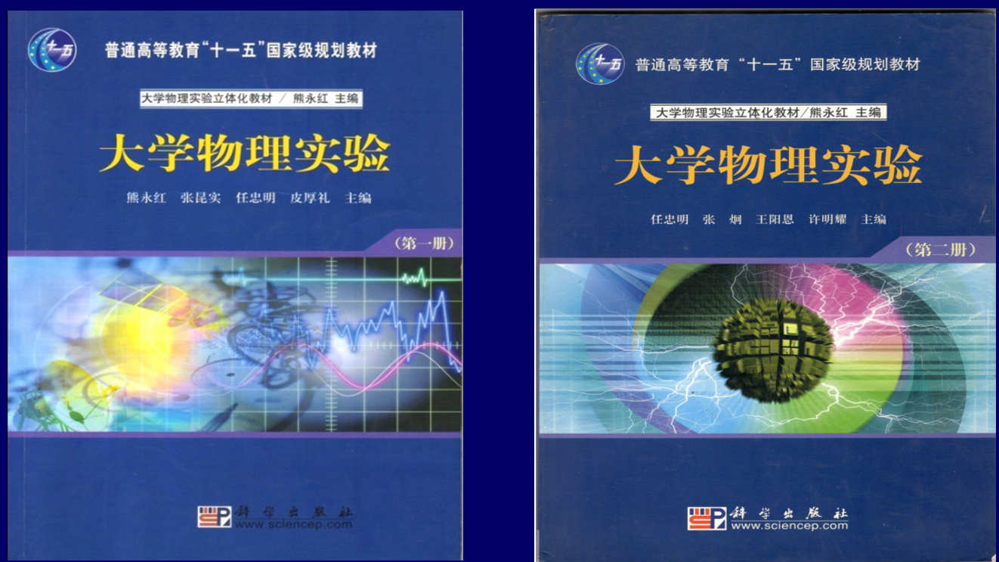

绪论PPT在选课系统中某些实验的资源里有，大家可以自行检索查收。

第一次课最后老师会要求大家完成课堂小测，每个老师要求做的题不一样，但肯定是下面这些的一部分。

> [!TIP]
>
> 小测答案：
>
> 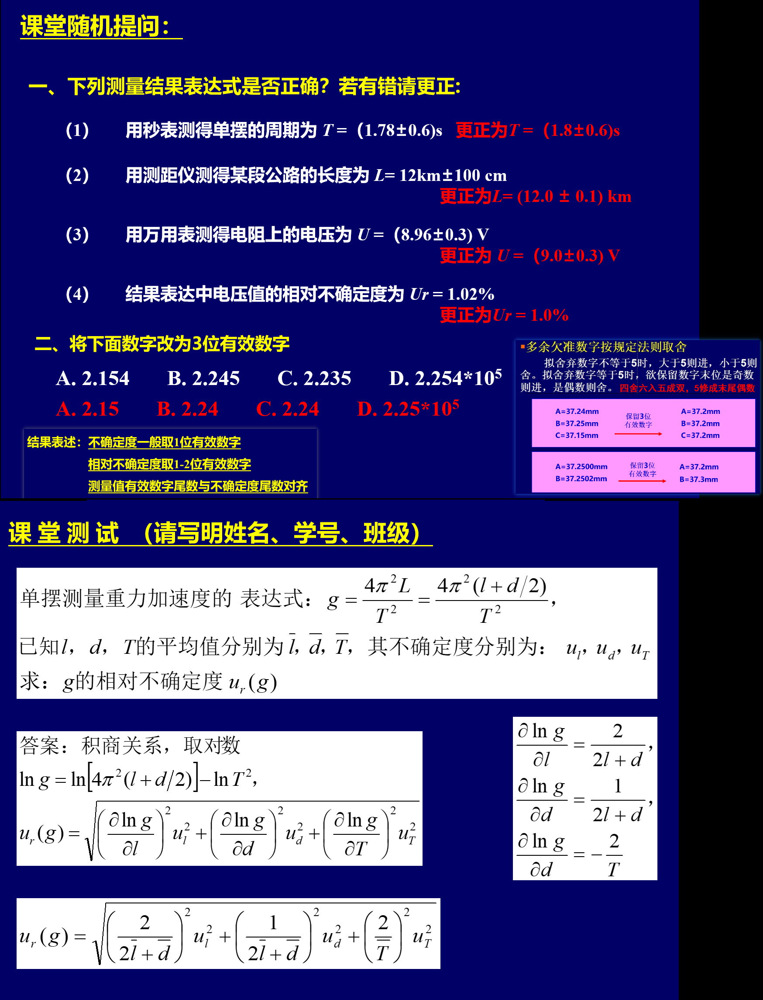

## 关于选课

### 注意事项

> [!CAUTION]
>
> 1. **<u>不允许跨段选课。</u>** 每学期会被分为上下两段，请大家按照课表所示时间在对应周数内选课。跨段选课可能会导致分数录入异常从而影响最终成绩。

2. **选满规定数量的实验。** 少选实验，对应分数记为0。先保证自己有实验可做，再去考虑实验和老师怎么样。因个人原因错过实验时间导致旷课的（特殊情况请联系老师，老师联系方式在系统课表里有），请在系统中补选对应数量的实验。

> [!TIP]
>
> 3. **注意关注系统。** 系统开放选课的时间不定，大家注意经常关注系统。
>    
>   貌似实验开始前任意时刻均可退选与选课，保险起见与避免实验资源浪费，强烈建议实验开始24小时内不要退选。

4. **选课前仔细检查空闲时间。** 选课系统不会自动检查课程冲突。注意实验时间不要和课程与考试冲突了。

### 系统使用指南

写本文时，由于本人已升入大二下，选课账号已被注销，无法查看里面的内容。此处引用绪论PPT中的界面。

#### 手机端

查看方法：企业微信-工作台-教育教学-物理学院选课系统

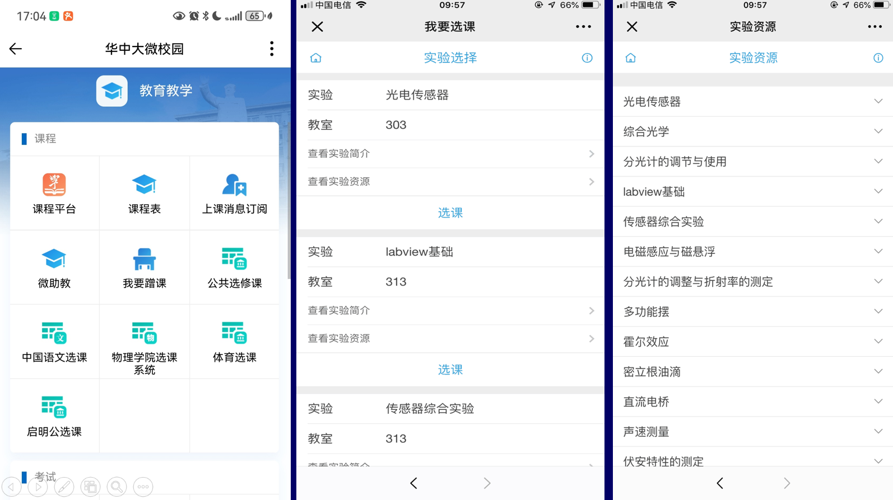

下载讲义、PPT等：实验资源-点击对应实验-查看实验资源-打开对应文件 改选课程：课程管理-退选对应课程，我要选课-选择实验-选择空闲课堂（每日有选课次数限制）

#### 网页端（推荐）

网址：[empxk.hust.edu.cn](http://empxk.hust.edu.cn)

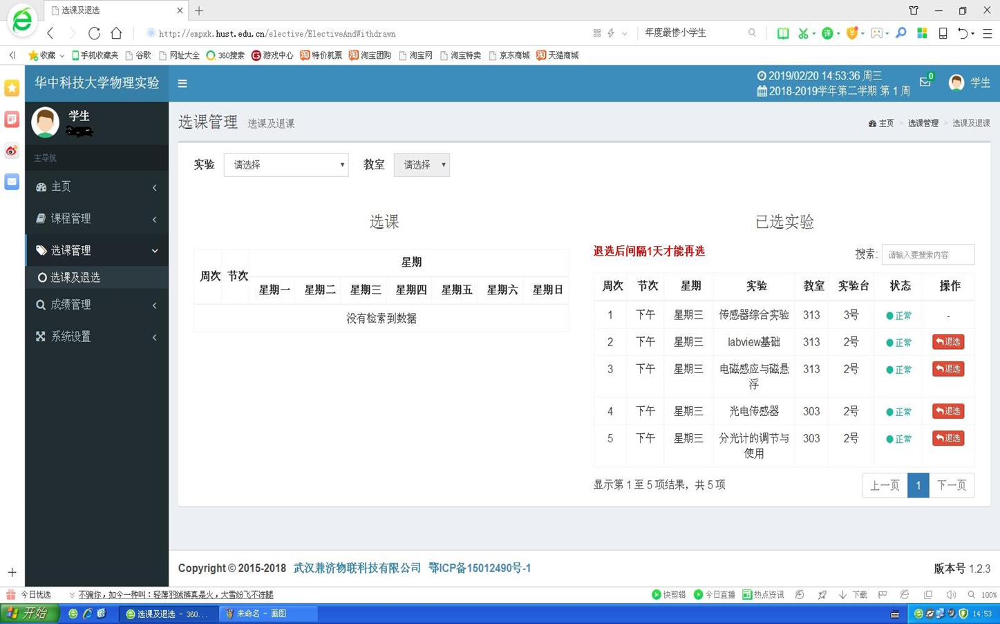

下载讲义、PPT等：课程管理-点击对应实验的资源-下载对应文件 改选课程：选课管理-右侧退选对应课程；左侧选择实验和教室-选择空闲课堂（每日**没有**选课次数限制）

### 各实验评价

个人评价，仅供参考。部分没做过的实验参考了大家的意见。本人不对本课程任课老师进行评价。

备注中的excel均放置在本仓库与网盘链接中，讲解视频已上传至bilibili平台。链接在上述“2. 写在前面”中，[点击此处跳转](# 写在前面)。

#### 上半段

对应课程：物理实验（上）、物理实验（二）

| 实验名称                 | 原名                 | 实验内容                                               | 评价                                                         | 个人打分 | 备注                |
| ------------------------ | -------------------- | ------------------------------------------------------ | ------------------------------------------------------------ | -------- | ------------------- |
| 示波器的使用             | /                    | 信号源、示波器的使用；RLC电路的暂态过程                | 最有用的一集。评价不一，本人觉得不难。强烈建议大家选上，之后你可能会经常和示波器打交道。选做实验比较麻烦可以不看 | 9        | 提供excel与讲解视频 |
| 比热容与热导率的测量     | 金属热学性质         | 不同冷却环境下测量金属的比热容；流体换热法测量导热系数 | 适合摆子的实验，等冷却时间很长，很闲。数据比较多。误差可能会比较大。没有选做实验 | 9        |                     |
| 分光计的使用             | /                    | 分光计的调节；三棱镜折射率的测量                       | 虽然是光学实验但是不难，报告很少。稍微有点吃设备，主要看前面一个人对设备动的狠不狠 | 9        | 提供excel与讲解视频 |
| 波尔共振与混沌摆         | /                    | 测量自由振动周期、阻尼系数、受迫振动的幅频/相频特性    | 电脑实验，考试也简单。操作步骤稍微有点繁琐。记得带U盘，选做实验需要截图而且不算很难 | 9        | 提供excel与讲解视频 |
| 转动惯量与杨氏模量的测量 | 物体力学性质综合实验 | 扭摆法测物体的转动惯量；拉伸法测量金属丝的杨氏模量     | 必做实验比较简单，记得记实验时中间的参数。选做实验有点复杂。数据处理稍微有点麻烦 | 8        |                     |
| 音叉与弦的受迫振动       | 振动力学             | 音叉的受迫振动；弦音实验                               | 吃设备。简单好做，数据稍微有点多。没有选做实验               | 8        |                     |
| 电子元件伏安特性         | 伏安特性的测定       | 线性电阻、非线性电阻（二极管、三极管）的伏安特性       | 大接线实验，必做很简单，数据处理注意位数就行。稍微有点吃设备。选做实验三极管对接线要求比较高，可以先做PN结那个 | 8        | 提供excel与讲解视频 |
| 人体生物信号测量         | 生物物理实验         | 人耳听阈曲线/血压心率/人体阻抗的测量                   | 吃设备。环境影响比较大。测阻抗对接线要求较高。数据可能会比较离谱，可以根据经验多测几次选组好的。几乎没有数据处理 | 7        | 提供excel与讲解视频 |
| 密立根油滴实验           | /                    | 油滴法测量电子的电量                                   | 吃设备。实验本身不难，有点考耐心。数据处理也不难，但是要求规范 | 7        | 提供excel与讲解视频 |
| 霍尔效应                 | /                    | 对称消除法测量半导体的霍尔系数；测量磁场分布           | 实验本身很简单，但是数据处理几百个数据巨恶心，考试也不简单   | 5        | 提供excel与讲解视频 |
| 单摆与三线摆             | 基础力学             | 测量重力加速度                                         | 吃设备。容易出现大误差（甚至50%以上）。数据处理比较麻烦，而且对过程要求比较高 | 3        |                     |
| 光的干涉和衍射           | 波动光学             | 双缝干涉、夫琅禾费衍射                                 | 吃设备。报告内容较多，衍射的光路调整较难，很难得高分。容易出现大误差。数据处理比较少 | 3        |                     |

#### 下半段

对应课程：物理实验（下）

| 实验名称                  | 原名           | 实验内容                                               | 评价                                                         | 个人打分 | 备注                |
| ------------------------- | -------------- | ------------------------------------------------------ | ------------------------------------------------------------ | -------- | ------------------- |
| 多功能太阳能电池特性      | /              | 太阳能电池输出伏安特性与充电特性                       | 最简单的一集，选到就是赚到。操作、数据处理、考试都简单。选做实验也很简单 | 10       | 提供excel与讲解视频 |
| 稳态法测量导热系数        | 导热系数的测量 | 傅里叶热传导定律；稳态法测量不良导热材料的导热系数     | 适合摆子的实验，等加热时间很长，很闲。报告很少，数据处理稍微有一点麻烦。没有选做实验 | 9        | 提供excel与讲解视频 |
| 核磁共振实验              | /              | 扫场法观察核磁共振现象                                 | 报告很少，实验简单。考试稍微有点难                           | 9        |                     |
| 交直流电桥的应用          | /              | 平衡电桥、非平衡电桥测量电阻；交流电桥测量电容（电感） | 大接线实验，建议选天冷的时候，不然选做等冷却来不及做。报告有点长。实验简单。数据处理一般，算电阻值需要稍微推一下 | 8        | 提供excel与讲解视频 |
| 巨磁电阻效应及应用        | /              | 测量巨磁电阻磁传感器内部电阻的磁阻特性                 | 报告内容不多。实验简单。数据比较多，处理起来有点麻烦         | 8        |                     |
| 偏振光与双折射            | /              | 验证马吕斯定律；椭圆偏振光、圆偏振光的调节             | 实验本身不难，记得固定好仪器。数据处理有点麻烦，会用到Origin，用Excel也能实现 | 8        | 提供excel与讲解视频 |
| 声速与光速测量            | /              | 超声声速和光速的测量                                   | 需要有示波器使用经历，不然上手有点困难。难度一般，数据可能会比较抽象。数据处理需要注意有效数字位数，稍微有点麻烦 | 8        | 提供excel与讲解视频 |
| 液体粘滞系数的测量        | /              | 落球法测量液体的粘滞系数；显微镜的使用                 | 操作不难，误差可能有点大。要选对小球。建议选天冷的时候，不然数据可能不准。数据处理注意有效数字位数。考试简单 | 7        |                     |
| 液体表面张力的测量        | /              | 拉脱法、毛细管法测量液体的表面张力                     | 讲义比较笼统，实验难度不大，有点考耐心。考试简单             | 7        |                     |
| 万用表组装                | /              | 基于数字芯片的万用表组成和工作原理                     | 报告较长。实验本身比较简单，数据比较多。考试巨难             | 5        |                     |
| 光电效应与弗兰克-赫兹实验 | /              | 光电效应与普朗克常数测量；测量汞原子的第一激发电位     | 二合一大体量实验，报告巨长。实验本身不难，选做实验弗兰克那个比较麻烦。数据处理死亡级别的。考试简单 | 3        | 提供excel与讲解视频 |
| 迈克尔逊干涉              | /              | 迈克尔逊干涉仪的调节；测定激光波长；观察等倾干涉       | 吃仪器。实验难度大，超级考耐心，很伤眼睛。                   | 3        |                     |

## 关于正课（实验）

### 前期准备

买好需要的纸。校内各教育超市均有售。 需要用到的纸张包括：**物理实验专用报告纸、物理实验专用数据记录纸**、方格纸（示波器实验有些老师会要求用到，作图按需选用），如下图所示。 一般来说，一次实验平均会用到2张报告纸、2张记录纸，大家可根据实验数量推算张数。方格纸若无作图需要买一张小的即可，以防万一可以买两张小的或一张大的。

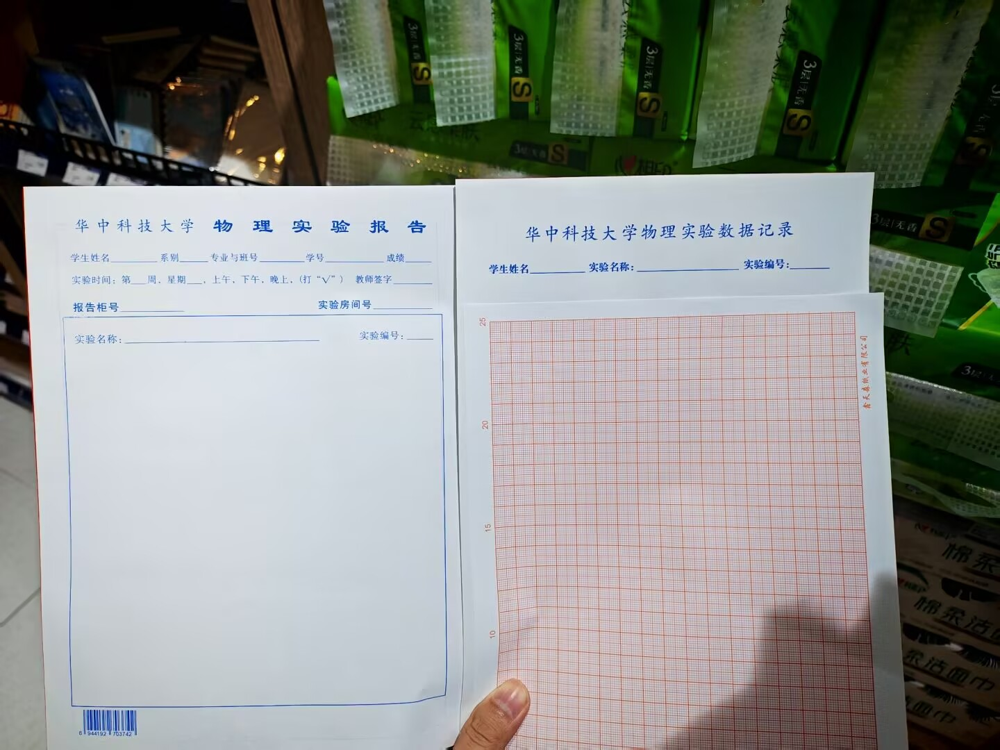

### 课前预习

按照上述5.2中的操作方法（[点击此处跳转](# 系统使用指南)），下载讲义、PPT等资料。系统中的课表包含教师联系方式，大家记住就好。

根据实验资料（讲义/PPT），完成（抄）预习报告。部分实验的报告样例在本仓库/网盘链接中已经给出（[点击此处跳转](# 写在前面)）。小红书和部分学院公众号等平台也有报告样例，大家可做参考。

一份合格的预习报告应该包含以下部分： **实验目的、实验原理、实验仪器、实验内容（包含步骤）**

**差不多两个格子即可（报告纸正面写满）**，如果比较多可以多抄一点，不同老师标准不一样，有些觉得完整一点比较好，有些觉得概括一点比较好。实验编号就是系统上的“实验台”编号，报告柜号由班长/学委提供。

参考示例：

另外，建议大家准备好空表格用于数据记录。

参考示例：
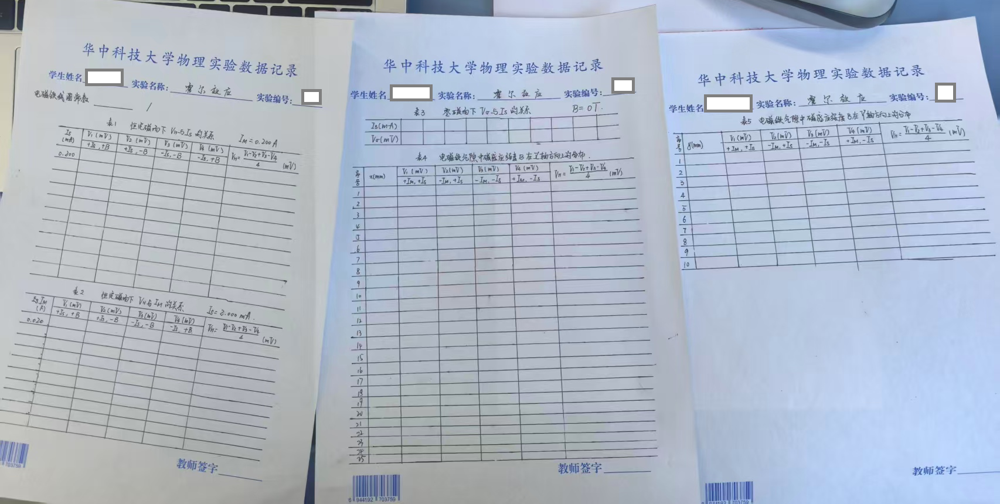

### 去上课

看好课表，务必带好校园卡，提前到达实验室。 **不要掐点！不要掐点！不要掐点！**晚1秒刷卡也是迟到！迟到一次总成绩-0.5！

建议再带好一沓空白数据记录纸和草稿纸备用。

到达教室，在**教室前方刷卡机刷卡签到**。桌子上有贴编号，对号入座。桌上有文件夹，里面是讲义和PPT（公共，请勿带走）。 手机放入包中，存放至指定位置。拿出预习报告和水笔（示波器实验还要拿格子纸和铅笔橡皮尺子），按老师要求向老师提交预习报告。 可以把空白数据记录纸、草稿纸和餐巾纸、水杯、计算器也一并拿出来备用。 为了实验安全，水杯请放在地上。

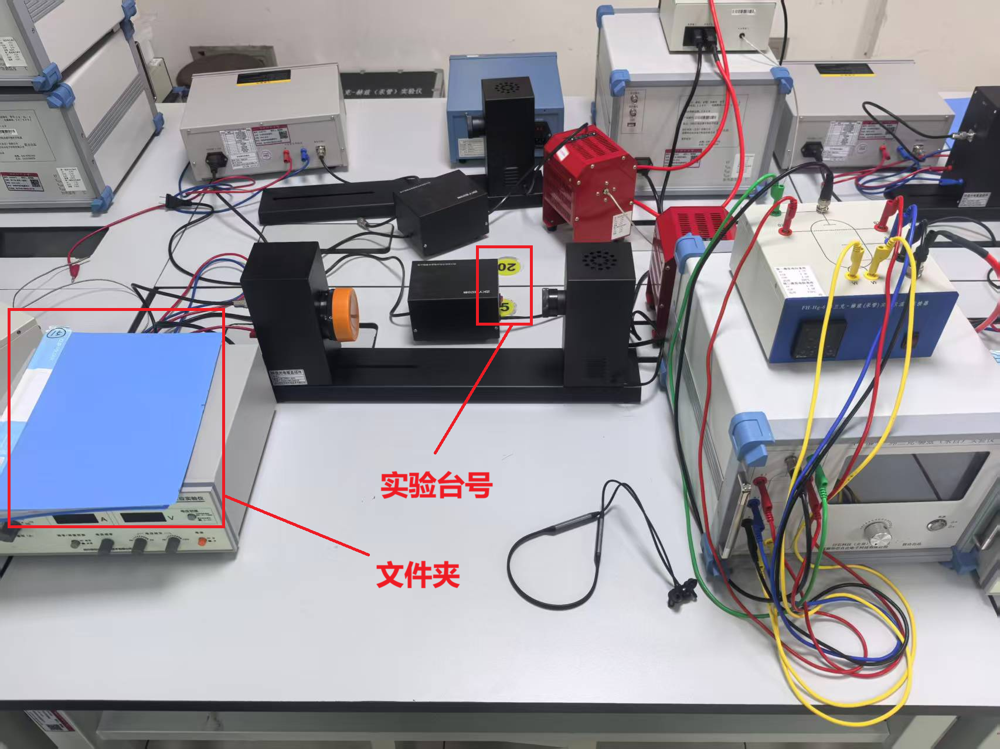

上课时间到，开始实验。前面先听老师讲解，然后自己独立动手操作，有问题问老师，视情况也可求助周围同学。

> [!CAUTION]
>
> **注意实验数据必须用水笔记录，不允许使用修正带和铅笔！**（示波器作图除外）

记错了请划去，尽量不要涂改。

做完必做实验，将写好的数据记录纸交给老师检查。老师检查通过后完成选做实验或进行数据处理与分析。若完成选做实验，做完后记得务必找老师再次检查选做实验结果！（选做实验数据旁边标一下“选做”两个字）

参考示例：

### 课后数据分析

完成实验报告的剩余部分。一份合格的实验报告除了包含预习报告外，还应包含以下部分： **数据处理与误差分析、思考题、实验小结/心得**

参考示例：

### 提交报告

一周内将实验报告和数据记录纸提交至实验室门口的报告柜。数据记录纸夹在实验报告里面以免丢失。交的时候注意看清报告柜格子上对应的**实验**和**时间**以免交错。

实验结束后，老师打完分后会同步在系统中显示。有的老师批的快，有的老师批的慢，不建议主动去催老师。 但结课考试前3天若系统中仍没有成绩，请联系老师。老师联系方式在系统实验资料的小课表中。

## 如何写好一份报告

### 除了努力之外的技巧

除了努力、把字写好写整齐之外，下面的小技巧也能帮助你写出一份好的报告：

1. **报告结构明确清晰** 每个部分区分清楚，各个实验的分析不混在一起。
2. **正确绘制图表** 一张图表应该包含**图名**、**图例**（单图例可不画）、作图区（**数据点**与**拟合曲线(若有)**）、**坐标轴（刻度间距合理）**及对应**物理量名称**与**单位**，若有拟合直线应给出**直线方程（表达式）**与**相关系数（R值）**。缺一不可。
   参考示例：
   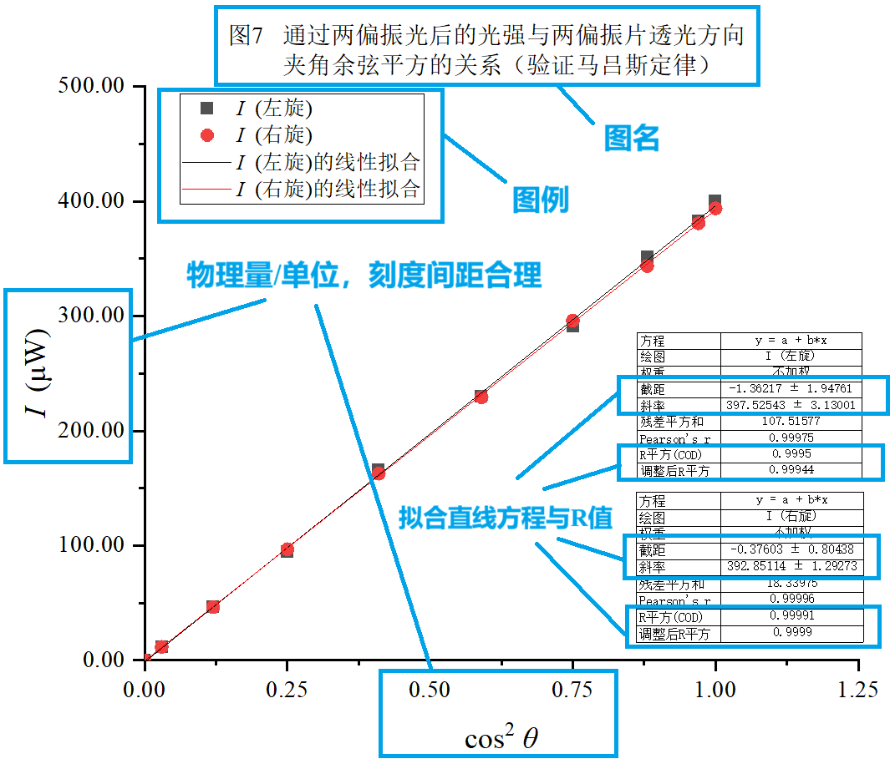
3. **给出完整且正确的计算过程** 计算过程应给出公式、带入数值。不确定度计算可参考绪论PPT，下面7.2（[点击此处跳转](# 需要用到的前置知识)）给出了部分内容。  参考示例：
   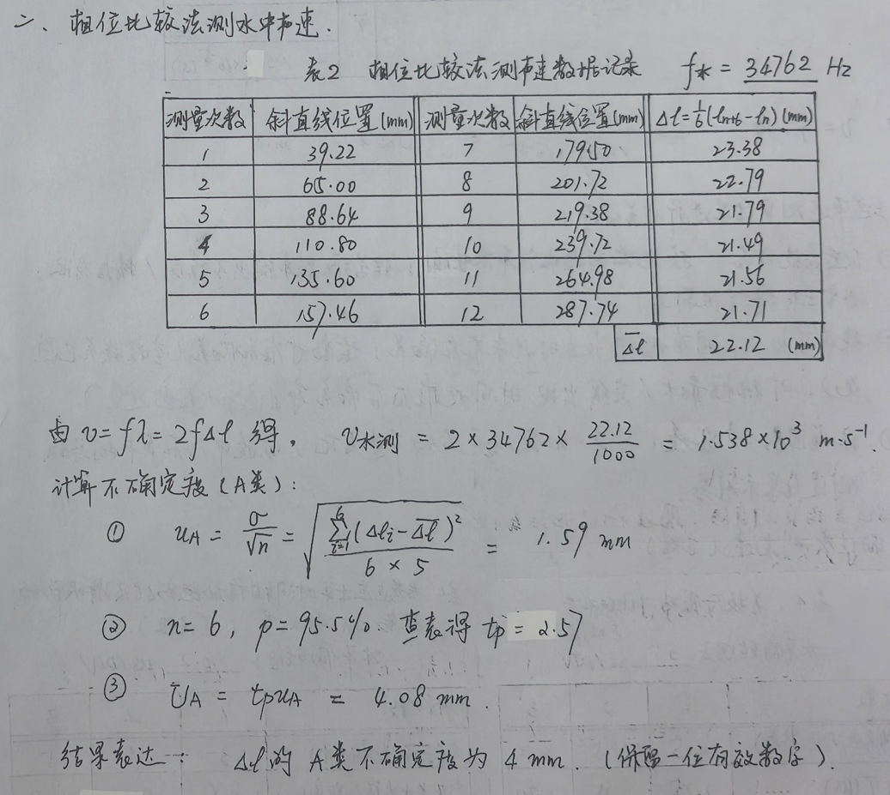
4. **正确取舍有效数字** 理论上，计算时需要严格遵循有效数字取舍法则（下面7.2（[点击此处跳转](# 需要用到的前置知识)）给出了取舍方法）。但由于Excel自身的特性，同时也是为了计算方便，我们可通过尽可能在计算中间过程保留精确性的方法，仅在最后一步进行有效数字的取舍。

其实说到底就是细节决定成败。

### 需要用到的知识

#### 不确定度计算

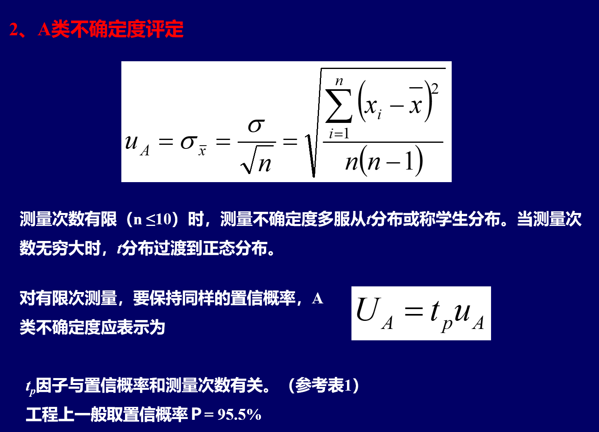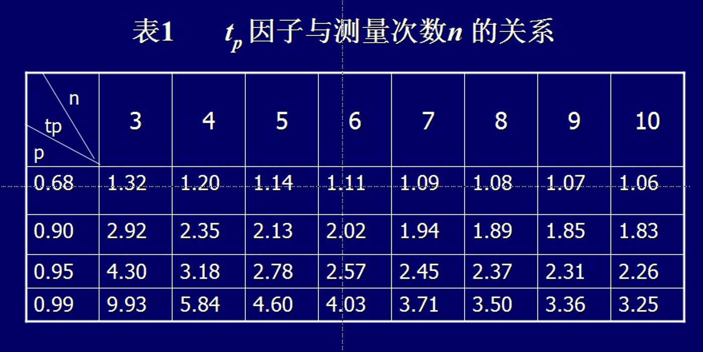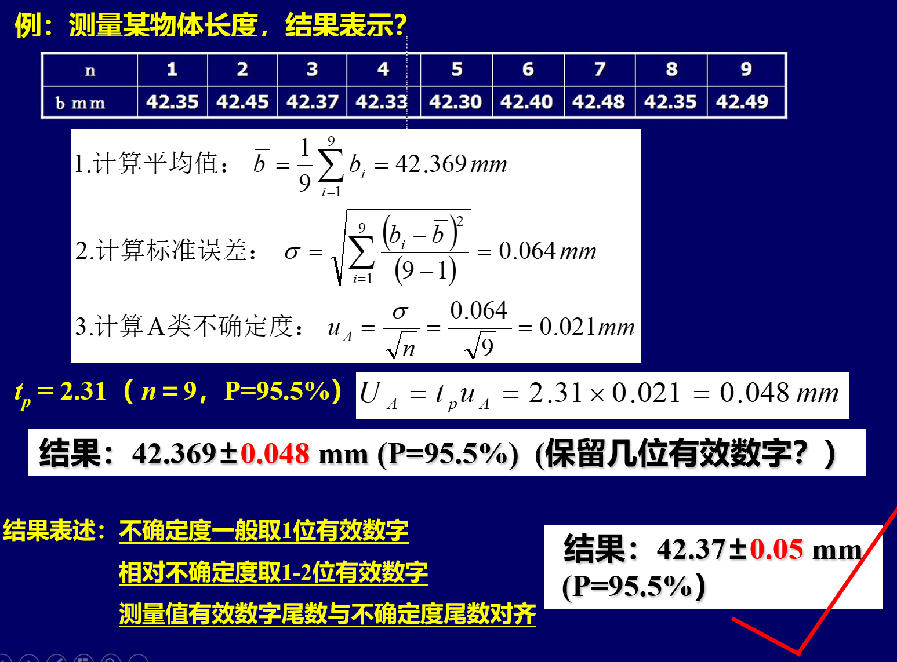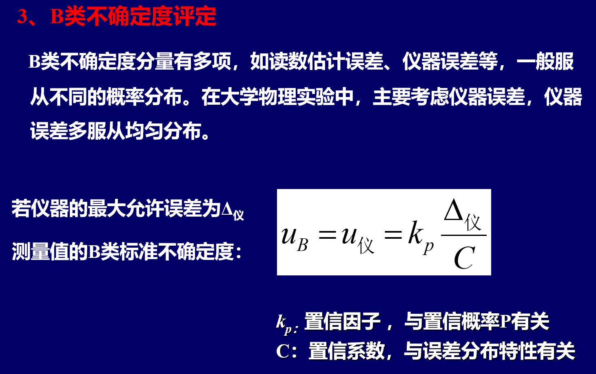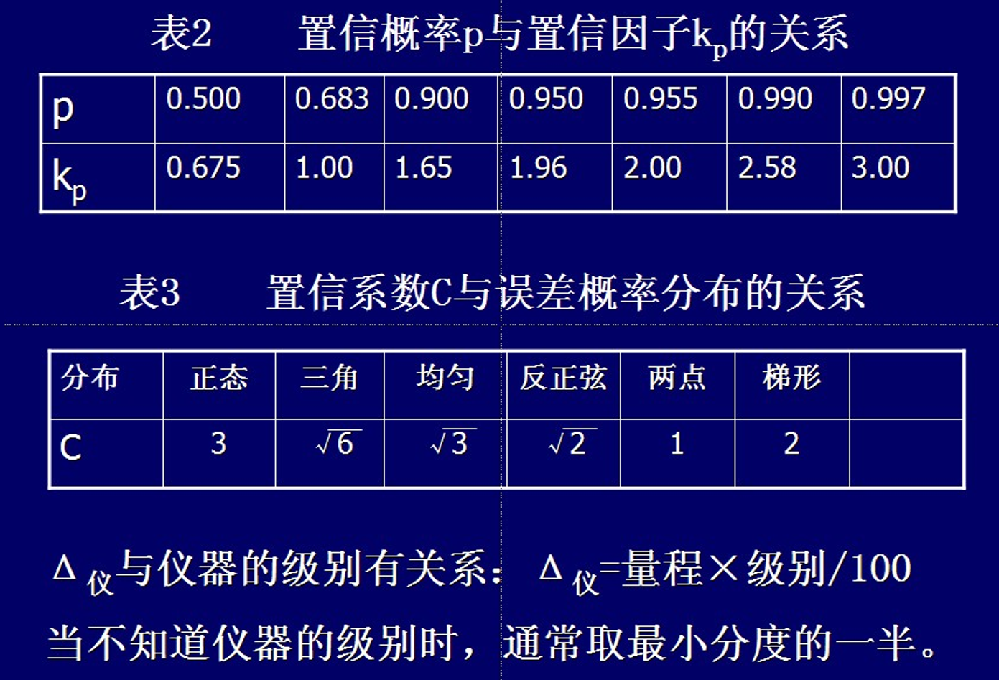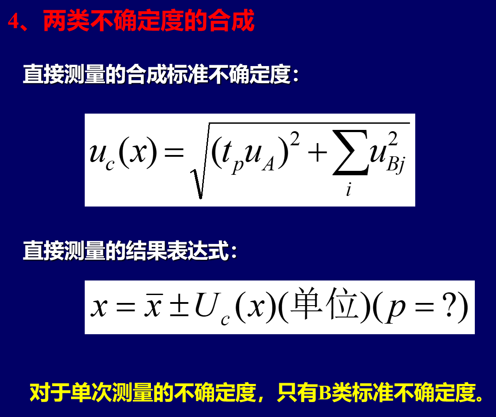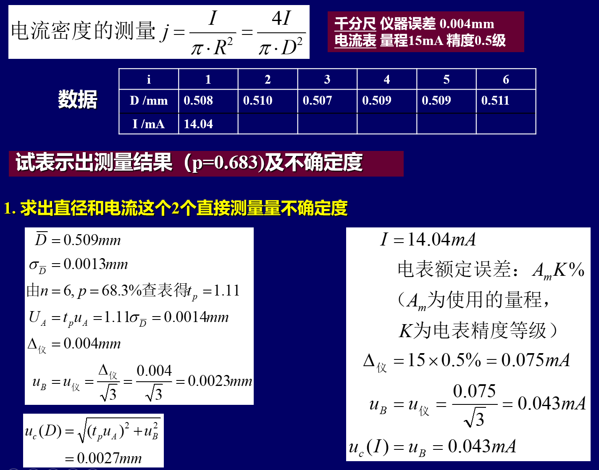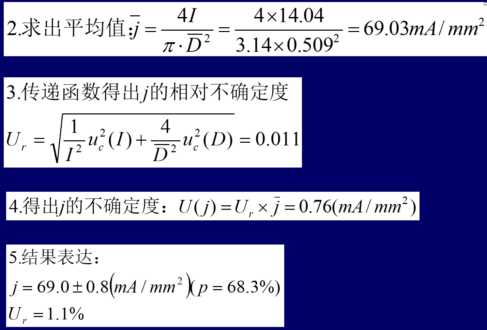

间接不确定度的计算比较复杂，且一般会直接给出公式，我们这里不列举。

#### 有效数字取舍准则

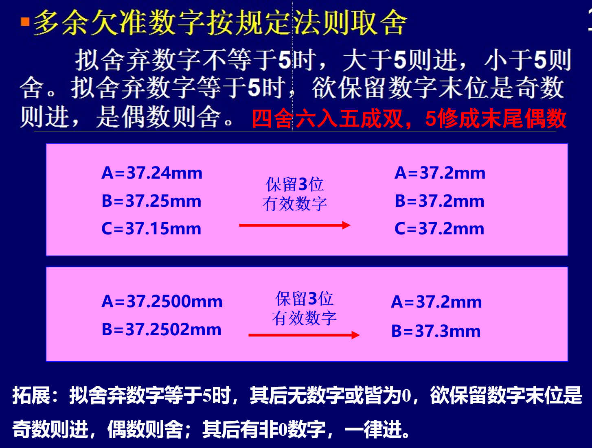

## 关于考试

### 考试形式

闭卷考试，时间60分钟。题型为选择题、判断题、填空题。根据实验不同，部分实验只设客观题。考试时会给出全部实验的题目，按照要求选择规定数量的实验作答即可。上学期6个，下学期6个，医科为5个。可以选没做过的实验。

### 一些小技巧

提前看看讲义和PPT。因为可以选没做过的实验，所以可以建议看看自己没做过的实验，特别是比较简单的。

## 写在后面

本企划中的内容参考了很多小红书上的内容，由于人数较多此处不一一列举；做实验前后本人也从众多前辈、同辈与后辈处得到了很多技巧与选课策略，在此一并表示感谢！也欢迎大家在小红书和各大社交平台上给众多帖子点赞收藏！

感谢yuhang同学给了我启发，使我不断完善之前的资料，最终汇聚成现在的成果。 感谢兔兔和小特，感谢你们给了我前行的动力。明明有很多话想对你们说，改了又改却始终不知如何下笔。 感谢每一位视频的观看者与使用过这些资料的大家。没有大家的支持，我不会走到现在。

*用短暂的一生，做一些有意义的事*。

最后，希望你能以最高的效率，顺利通关大物实验！

momooo 26/3.14
